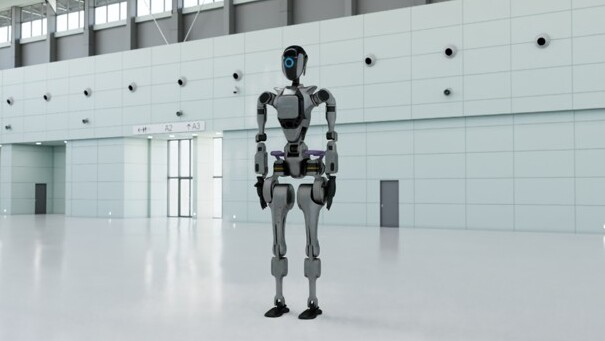

# NVIDIA ovrtx

[](https://nvidia-omniverse.github.io/ovrtx)
[](LICENSE)
[](https://github.com/NVIDIA-Omniverse/ovrtx)
[](https://github.com/NVIDIA-Omniverse/ovrtx/actions/workflows/docs.yml)

**ovrtx** is a C and Python library for embedding Omniverse RTX sensor simulation and visualization directly into applications. 

**ovrtx** is best suited for developers looking to build applications, tools or workflows that need real-time, physically accurate camera, lidar, radar, and other sensor simulation for [Physical AI](https://www.nvidia.com/en-us/glossary/generative-physical-ai/), targeting robotics learning, synthetic data generation, and industrial and design workflows.

Starting with **ovrtx** version **0.4**, ovrtx integrates with the NVIDIA Omniverse [**ovstage**](https://github.com/NVIDIA-Omniverse/ovstage) library. **ovstage** supports loading of USD data to a runtime representation, manages the runtime scene data, ordinal-keyed simulation steps, and change detection. Renderer-owned scene data loading and management APIs remain available in 0.4 for compatibility, but are deprecated. Scene ownership will transition entirely to ovstage in a future release.

> [!NOTE]
> ovrtx is currently **pre-release** software.

To get started with ovstage follow the instructions blelow for the included Python and C/C++ examples.
* [Get started in Python](#getting-started-in-python)
* [Get started in C](#getting-started-in-c)

Sources live under [`examples/`](examples/) and are the source of truth for the code snippets referenced by the ovstage skills — see the [examples index](examples/README.md).


## High-level Feature Set

* Physically accurate simulation of cameras, lidar, radar, and other sensors.
* Scalable simulation performance from reinforcement learning in-the-loop with tens of thousands of frames per second, through real-time, photorealistic, interactive viewport and navigation, to offline predictive rendering.
* Support for loading [USD](https://aousd.org/) scene description via [**ovstage**](https://github.com/NVIDIA-Omniverse/ovstage). Compatibility with OpenUSD allows interchange with a vast ecosystem of content creation, CAD and simulation tools.
* Easy integration with Python simulation and AI ecosystem.

## Packaging and Dependencies

ovrtx is distributed as a C package (.zip file) available in the Releases page in this repo, and as Python wheels available via pypi.org.
These packages include a number of pre-packaged dependencies.

In addition to these pre-packaged dependencies, two other depedencies are noted here:
1. starting with version 0.4 of ovrtx, a dependency on the NVIDIA [ovstage](https://github.com/NVIDIA-Omniverse/ovstage) library is introduced. 
    * While this dependency is currently optional, it will be required in the next release. To enable a smooth migration from the ovstage-like APIs included in ovrtx 0.3, the ovrtx 0.4 release continues including those APIs, marked with a deprecated tag. To ease the migration to ovstage, you can take advantage of the agent-friendly migration skills [for C](skills/update-0_3-0_4-python/SKILL.md) and [for Python](skills/update-0_3-0_4-c/SKILL.md).
2. on Windows, ovrtx depends on [Microsoft's VC runtime redistributable libraries](https://learn.microsoft.com/en-us/cpp/windows/latest-supported-vc-redist?view=msvc-170), with a minimum version of 14.38 (as included in Visual Studio 2022 17.8). 
    * These libraries can be installed by an end user (using the linked Microsoft resources) or can be included by an application. 
    * The use of this version of the MSVC runtime libraries makes our binaries compatible with the vcruntime140.dll pre-packaged in Python distributions for Windows as old as Python 3.11. Older Python versions include older vcruntime140.dll, and are therefore not guaranteed to work.

## System requirements

- **C/C++**:
    - The ovrtx library has a C11-compatible interface. It can be loaded dynamically or by statically linking to the `ovstage-static` loader library, which requires linking to the C++ stdlib. 
    - The example code requires a C++17 compiler and CMake 3.18+. The examples use cmake to fetch the prebuilt ovrtx and ovstage packages from their GitHub.com release pages.
- **Python**:
    - Python 3.11–3.13 versions are supported
    - The examples use [uv](https://docs.astral.sh/uv/) to resolve the `ovrtx` wheel.
- CUDA-capable environment for GPU-resident data paths; CPU payload paths are also part of the API surface.
- DLPack-compatible tensor data for CPU/GPU interchange.


## Getting Started in Python

[ovrtx](https://pypi.org/project/ovrtx/) and [ovstage](https://pypi.org/project/ovstage/) Python wheels are distributed on [PyPI](https://pypi.org/). We recommend using [uv](https://docs.astral.sh/uv/getting-started/installation/) to install both packages:

```bash
uv add ovrtx ovstage
```

`pip` also works:

```bash
pip install ovrtx ovstage
```

ovstage is optional when maintaining standalone compatibility code. The renderer-owned scene APIs used by that mode are deprecated in ovrtx 0.4.

All the examples in this repository contain pyproject.toml files that are tested with uv. Python 3.11-3.13 are supported.

If installation fails, first verify that you are using Python 3.11-3.13 and that your environment can reach PyPI. If you need a specific release artifact, GitHub Releases also contain Python wheels that can be installed explicitly.

To get started with the repository examples, first clone this repository and run the minimal example with uv:

```bash
git clone https://github.com/NVIDIA-Omniverse/ovrtx.git
cd ovrtx/examples/python/minimal
uv run main.py --png
```

See the [Python minimal example documentation](examples/python/minimal/README.md) for more information on environment setup and prerequisites.

The minimal example shows how to create the renderer, load an OpenUSD scene and render a single image, copying the results back to the CPU for display.




The first step from a newly built application will block for 1-2 minutes while shaders are compiled and cached.

## Getting Started in C/C++

The C/C++ examples require CMake and a development environment. On Windows this is provided by [Visual Studio 2017 or newer](https://visualstudio.microsoft.com/).


On Linux (Ubuntu):

```bash
sudo apt-get install build-essential cmake
```

To get started, first clone this repository:

```bash
git clone https://github.com/NVIDIA-Omniverse/ovrtx.git
cd ovrtx/examples/c/minimal
```

Then configure, build, and run the minimal example for your platform.

On Windows:
```
cmake -B build
cmake --build build --config Release
.\build\Release\minimal.exe
```

On Linux:
```bash
cmake -B build -DCMAKE_BUILD_TYPE=Release
cmake --build build
./build/minimal
```

See the [C minimal example documentation](examples/c/minimal/README.md) for more information on environment setup and prerequisites.

The minimal example shows how to create the renderer, load an OpenUSD scene and render a single image, copying the results back to the CPU for writing out as a PNG.


The resulting image will be written to `./out.png` and can be inspected with any image viewer.

The first step from a newly built application will block for 1-2 minutes while shaders are compiled and cached.

## Examples

Further examples using both the C and Python APIs are available in the [examples](examples/README.md) directory. See the individual examples for building and usage instructions.

## Releases

The Releases page of this repository contains binary builds for the official releases of the ovrtx C library and also includes corresponding Python wheels. PyPI is the recommended consumption path for Python users.

These binaries are provided for the supported platforms:
 * Windows x86_64
 * Linux x86_64
 * Linux aarch64

The libraries require a compatible NVIDIA RTX-capable GPU with a compatible NVIDIA driver on the system to be able to initialize correctly.
Supported driver versions are listed in [Driver requirements](docs/driver_requirements.rst).


## Testing

Tests live under `tests/docs/` in three independent suites: Python, C, and USD validation.

> **ovrtx 0.4 compatibility:** Stage-owning Python documentation tests request an attached ovstage fixture, with focused compatibility coverage for deprecated renderer wrappers. C documentation tests remain on deprecated standalone renderer stage APIs. USD validation tests do not exercise either stage-ownership model.

### Python tests (GPU required)

```bash
cd tests/docs/python

# Run the full suite
uv run pytest -v

# Run a single test
uv run pytest test_base.py::test_base -v
uv run pytest test_base.py::test_bind_material -v
```

### C tests (GPU required)

```bash
cd tests/docs/c
cmake -B build
cmake --build build --config Release

# Run the full suite
cd build && ctest --output-on-failure

# Run a single test
ctest -R BaseTest.RenderLdrColor --output-on-failure

# Or use the gtest binary directly
./ovrtx_docs_tests --gtest_filter=BaseTest.BindMaterial
```

### USD validation tests (no GPU required)

```bash
cd tests/docs/usd
uv run pytest -v
```

Rendered images are written to `_output/` under the respective suite directory.

## Documentation

Documentation is published at https://nvidia-omniverse.github.io/ovrtx

* [Python getting started](https://nvidia-omniverse.github.io/ovrtx/python_api/getting_started.html)
* [C getting started](https://nvidia-omniverse.github.io/ovrtx/c_api/getting_started.html)
* [Examples](examples/README.md)

Full build instructions, prerequisites, and platform-specific notes are in [docs/README.md](docs/README.md).

### Building the Documentation

**Prerequisites:** [uv](https://docs.astral.sh/uv/) and [Doxygen](https://www.doxygen.nl/) (see [docs/README.md](docs/README.md) for Windows installation and project-local download options).

**Linux:**
```bash
cd docs
make html
```

**Windows:**
```bat
cd docs
make.bat html
```

Then serve the output locally:
```bash
uv run python -m http.server 8000 -d _build/html
```

Then open http://localhost:8000/ in a browser.

---

## Contributing

At this time this project is not open to external contributions.

## Authors and acknowledgment

NVIDIA Corporation

## License and security

The software and materials are governed by the [NVIDIA Software License Agreement](https://www.nvidia.com/en-us/agreements/enterprise-software/nvidia-software-license-agreement/) and the [Product Specific Terms for NVIDIA AI Products](https://www.nvidia.com/en-us/agreements/enterprise-software/product-specific-terms-for-ai-products/).

This project will download and install additional third-party open source software projects. Review the license terms of these open source projects before use.

To report a security issue, see [`SECURITY.md`](SECURITY.md). **Do not report security vulnerabilities through GitHub/GitLab.**

## Support

Report documentation issues, installation problems, and runtime issues through the NVIDIA Omniverse developer forum.
https://forums.developer.nvidia.com/c/omniverse/300

## Roadmap

A public roadmap will be shared as ovrtx approaches general availability.
For recent additions and changes, see the [release notes](https://github.com/NVIDIA-Omniverse/ovrtx/releases).

## AI Coding Agents

The [skills](skills) directory contains a series of Skills to help AI coding agents to understand how to use the API (and they're useful for humans too). Copy this directory to your project and point your agent at it.

Agents should use the [Python minimal example](examples/python/minimal/README.md) as the first runtime validation unless C is specifically requested. Follow that example's README for validation steps, and use [Driver requirements](docs/driver_requirements.rst) to check supported NVIDIA driver versions.

---

*Copyright (c) 2026 NVIDIA Corporation.*
