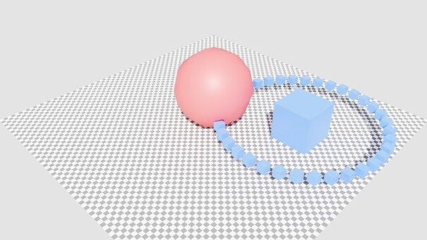

.. SPDX-FileCopyrightText: Copyright (c) 2026 NVIDIA CORPORATION & AFFILIATES. All rights reserved.
.. SPDX-License-Identifier: LicenseRef-NvidiaProprietary
..
.. NVIDIA CORPORATION, its affiliates and licensors retain all intellectual
.. property and proprietary rights in and to this material, related
.. documentation and any modifications thereto. Any use, reproduction,
.. disclosure or distribution of this material and related documentation
.. without an express license agreement from NVIDIA CORPORATION or
.. its affiliates is strictly prohibited.

Python: Planet System
=====================

Animated planetary system demo using ovrtx Python bindings. Demonstrates loading a USD scene and injecting additional geometry using ``add_usd_reference_from_string``, using ``bind_attribute``/``map_attribute`` for zero-copy transform updates, and GPU-accelerated animation with Warp kernels. Planets orbit a central cube with hierarchical animation (orbit parent rotation + planet self-spin).

This example uses deprecated renderer stage APIs for its CPU and CUDA
attribute-mapping paths. Use the 0.3-to-0.4 migration skill when updating stage
management.

By default, rendered frames are streamed to `rerun.io <https://rerun.io/>`_ for live visualization. Frames can also be saved to disk as PNGs.

.. pull-quote::

   *“Create a Python animation example that loads a base scene, injects generated runtime geometry, creates persistent transform bindings, updates many transforms efficiently each simulation step using CPU or GPU compute, renders frames, optionally streams or saves them, and cleans up bindings explicitly.”*

Prerequisites
-------------

- Python 3.10-3.13
- `uv <https://docs.astral.sh/uv/>`_

Running
-------

.. code-block:: bash

   uv run main.py

Options
^^^^^^^

.. list-table::
   :header-rows: 1

   * - Flag
     - Description
   * - ``--gpu``
     - Device on which to copy animated transforms <cpu|gpu> Default: cpu
   * - ``--num-planets N``
     - Number of planets, 1-1000 (default: 36)
   * - ``--png``
     - Save rendered frames as PNGs to ``_output/``
   * - ``--no-rr``
     - Disable rerun.io streaming
   * - ``--log``
     - Enable carb log file in ``_output/``

The first time you run the example, the driver compiles and caches shaders. Subsequent runs are much faster.
