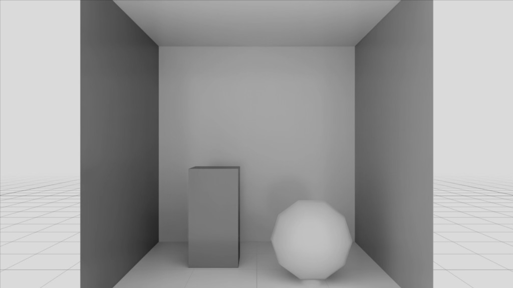
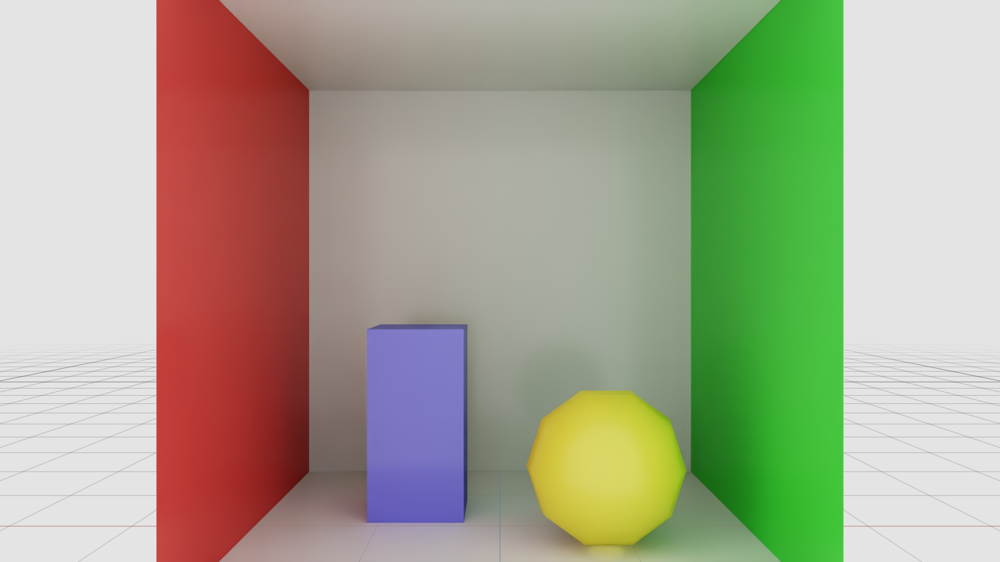

.. SPDX-FileCopyrightText: Copyright (c) 2026 NVIDIA CORPORATION & AFFILIATES. All rights reserved.
.. SPDX-License-Identifier: LicenseRef-NvidiaProprietary
..
.. NVIDIA CORPORATION, its affiliates and licensors retain all intellectual
.. property and proprietary rights in and to this material, related
.. documentation and any modifications thereto. Any use, reproduction,
.. disclosure or distribution of this material and related documentation
.. without an express license agreement from NVIDIA CORPORATION or
.. its affiliates is strictly prohibited.

Overview
========

Sensor Processing Graphs (SPG) enables running custom GPU code as post-processing passes on RTX render outputs
(Arbitrary Output Variables, or AOVs). You write a CUDA kernel, describe its launch
configuration in a Lua script, declare its interface in USD, and wire it into a
RenderProduct. All computation stays on the GPU -- there is no CPU-side data transfer
in the processing pipeline.

This guide assumes proficiency with CUDA kernel programming and basic familiarity
with USD (Universal Scene Description).

Prerequisites
-------------

- **CUDA** development knowledge is assumed. This guide does not teach CUDA
  programming; it focuses on the SPG-specific interface.

How SPG Works
-------------

Every SPG shader is defined by three files:

.. list-table::
   :header-rows: 1
   :widths: 20 80

   * - File
     - Role
   * - ``.cu``
     - **CUDA kernel** -- the GPU transform you write.
   * - ``.cu.lua``
     - **Lua launch script** -- tells SPG how to validate inputs, allocate outputs, and launch the kernel.
   * - ``.usda``
     - **USD shader definition** -- declares inputs, outputs, and references the CUDA source. Wired into the render graph.

.. code-block:: text

    .cu            .cu.lua          .usda
    (kernel)       (launch script)  (shader def)
       \               |               /
        \              |              /
         +-------  SPG Engine  ------+
                       |
                 Output AOV buffer

The rest of this guide teaches you to create these files through two hands-on
walkthroughs. SPG also ships pre-built nodes (the standard library) that you
can use without writing any code -- covered in
:ref:`spg-builtin-walkthrough`.

Walkthrough: Grayscale Conversion of LdrColor
---------------------------------------------

In this walkthrough you convert the RTX-rendered LdrColor image (RGBA uint8,
tone-mapped) into a grayscale image called ``LdrGrayscale``. You create three
shader files and one scene file, then load and run the result with the ovrtx renderer.

.. note::

   The complete, runnable project for this walkthrough (with ``main.py``, ``pyproject.toml``,
   and ``uv run main.py``) is :doc:`../examples/python_spg_grayscale`.

Step 1: The CUDA Kernel
~~~~~~~~~~~~~~~~~~~~~~~~

**File:** ``GrayscaleKernel.cu``

SPG compiles CUDA source at runtime using NVRTC (NVIDIA Runtime Compilation). Your
kernel is a standard ``extern "C" __global__`` function.

.. code-block:: c

    extern "C" __global__ void grayscale(
        int width,
        int height,
        cudaTextureObject_t inputLdrColor,
        cudaSurfaceObject_t outputLdrGrayscale)
    {
        int x = blockIdx.x * blockDim.x + threadIdx.x;
        int y = blockIdx.y * blockDim.y + threadIdx.y;

        if (x < width && y < height)
        {
            uchar4 pixel = tex2D<uchar4>(inputLdrColor, x, y);

            // ITU-R BT.601 luminance weights
            float luminance = 0.299f * pixel.x + 0.587f * pixel.y + 0.114f * pixel.z;
            unsigned char gray = (unsigned char)min(255.0f, max(0.0f, luminance));

            uchar4 out = { gray, gray, gray, pixel.w };
            surf2Dwrite<uchar4>(out, outputLdrGrayscale, x * sizeof(uchar4), y);
        }
    }

Key points:

- ``extern "C"`` is **required** -- NVRTC needs C linkage to locate the kernel by name.
- ``cudaTextureObject_t`` provides read-only, hardware-cached access to the input AOV.
- ``cudaSurfaceObject_t`` provides random-access write to the output buffer.
- ``uchar4`` matches the RGBA uint8 format of the LdrColor AOV.
- The bundled CUDA headers are available through ``#include`` (for example,
  ``#include <cuda_fp16.h>`` for half-precision support). The include path is
  automatically configured by SPG.

Step 2: The Lua Launch Script
~~~~~~~~~~~~~~~~~~~~~~~~~~~~~~~

**File:** ``GrayscaleKernel.cu.lua``

SPG uses Lua as a lightweight scripting glue between the USD graph and CUDA kernel
execution. Lua is small, fast to evaluate, and runs inside a secure sandbox that
prevents file-system access or unbounded computation. The launch script is called
each frame. (For a complete reference of all available Lua functions and types, refer to
:ref:`spg-lua-reference` at the end of this guide.)

The Lua function receives two tables:

- ``inputs`` -- all shader inputs, unified into a single table. This includes both
  resource-inputs (AOV data from connected ``opaque`` attributes) and value-inputs
  (USD-typed parameters like ``int``, ``float``, ``bool``). Resource-inputs have ``.shape``,
  ``.dtype``, and ``.rank`` fields. Value-inputs have a ``.value`` field containing the
  raw Lua value. You can distinguish them by checking whether ``.value`` is present.
- ``outputs`` -- you allocate these to describe the kernel's output buffers (using
  ``cuda.image`` or ``cuda.empty``). After allocation, outputs also expose ``.shape``
  and ``.dtype``.

The function name **must** match the CUDA kernel function name and the USD
``subIdentifier`` attribute.

.. code-block:: lua

    function grayscale(inputs, outputs)
        assert(#inputs["LdrColor"].shape == 2, "Input must be a 2D image")
        assert(inputs["LdrColor"].dtype == cuda.uchar4, "Input must be uchar4")

        local height = inputs["LdrColor"].shape[1]
        local width  = inputs["LdrColor"].shape[2]

        outputs["LdrGrayscale"] = cuda.image(width, height, cuda.uchar4)

        return cuda.kernel({
            -- void grayscale(int, int, cudaTextureObject_t, cudaSurfaceObject_t)
            args = {
                cuda.int(width),                             -- -> int width
                cuda.int(height),                            -- -> int height
                cuda.TextureObject(inputs["LdrColor"]),      -- -> cudaTextureObject_t inputLdrColor
                cuda.SurfaceObject(outputs["LdrGrayscale"]), -- -> cudaSurfaceObject_t outputLdrGrayscale
            },
            block = { 32, 32 },
            grid = { math.ceil(width/32), math.ceil(height/32) },
        })
    end

Key points:

- ``cuda.image(width, height, dtype)`` allocates a 2D texture-backed image output.
  Prefer this for image data. For non-image data (matrices, arrays, tensors), use
  ``cuda.empty({shape}, dtype)`` instead.
- ``cuda.TextureObject(...)`` and ``cuda.SurfaceObject(...)`` wrap resources into the
  corresponding CUDA types (``cudaTextureObject_t``, ``cudaSurfaceObject_t``).
- The ``args`` list must match the CUDA kernel's C function signature exactly -- same
  order, same types. Each inline comment shows the corresponding C parameter.
- Input/output keys (``"LdrColor"``, ``"LdrGrayscale"``) must match the USD attribute
  names exactly.
- ``block`` and ``grid`` map directly to the CUDA launch configuration
  (``<<<grid, block>>>``). Here, 32x32 thread blocks tile over the image dimensions.

Step 3: The USD Shader Definition
~~~~~~~~~~~~~~~~~~~~~~~~~~~~~~~~~~~

**File:** ``GrayscaleKernel.usda``

The USD shader definition declares the kernel's interface and points SPG at the
CUDA source file.

.. literalinclude:: ../../examples/python/spg-grayscale/GrayscaleKernel.usda
   :language: usda
   :start-after: # [snippet:shader-definition-template]
   :end-before: # [/snippet:shader-definition-template]

Key points:

- ``info:spg:sourceAsset`` -- path to the ``.cu`` file, relative to this ``.usda`` file.
- ``info:spg:sourceAsset:subIdentifier`` -- the ``extern "C"`` function name to invoke.
  Must also match the Lua function name.
- ``opaque inputs:LdrColor`` / ``opaque outputs:LdrGrayscale`` -- AOV inputs and outputs.
  The ``opaque`` type means the actual data type is resolved at runtime by the Lua
  launch script.
- The ``.cu.lua`` launch script must be co-located with the ``.cu`` file. SPG finds it
  by appending ``.lua`` to the source asset path (for example, ``GrayscaleKernel.cu`` +
  ``.lua`` = ``GrayscaleKernel.cu.lua``).
- This file is a reusable shader definition. Scene files reference it through USD
  ``references`` and wire its inputs/outputs to RenderVars.

For built-in reusable nodes, author ``info:implementationSource = "id"`` and
``info:id = "spg:<node-id>"``. The ``spg:`` marker scopes SPG node IDs away from
MaterialX and UsdPreview shader IDs.

Step 4: The Scene File
~~~~~~~~~~~~~~~~~~~~~~~

**File:** ``grayscale_scene.usda``

The scene file wires the shader into the RTX rendering pipeline. It defines:

- A **RenderProduct** associated with a camera and resolution.
- **RenderVars** declaring which AOVs to produce.
- A **Shader** instance referencing the shader definition.
- **Connections** linking RenderVars to shader inputs/outputs.

Below is the rendering pipeline section (the full scene file also includes
Cornell Box-inspired geometry with colored walls, a box, and a sphere):

.. literalinclude:: ../../examples/python/spg-grayscale/grayscale_scene.usda
   :language: usda
   :start-after: # [snippet:render-graph]
   :end-before: # [/snippet:render-graph]

Key points:

- **RenderProduct** ties a camera and resolution together and lists the active
  RenderVars through ``orderedVars`` (which AOVs are produced). Every RenderVar
  consumed or produced by shaders must appear in this list. SPG runs shader
  nodes in topological order from the dependency graph (connections), not from
  the order in orderedVars.
- **RenderVar** ``LdrColor`` declares the built-in LdrColor AOV produced by the RTX
  renderer. ``uniform string sourceName`` identifies the AOV, and
  ``opaque omni:rtx:aov`` exposes it as a connectable attribute.
- **RenderVar** ``LdrGrayscale`` receives the shader's output through
  ``omni:rtx:aov.connect``. It also needs a ``sourceName`` to register the AOV.
- **Shader** ``GrayscaleKernel`` references the reusable shader definition and
  connects ``inputs:LdrColor`` to the LdrColor RenderVar's ``omni:rtx:aov`` attribute.
- The connection pattern flows:
  ``RenderVar.omni:rtx:aov`` -> ``Shader.inputs:X`` -> ``Shader.outputs:Y`` ->
  ``RenderVar.omni:rtx:aov.connect``.

.. _spg-grayscale-run-it:

Step 5: Run It
~~~~~~~~~~~~~~~

Load ``grayscale_scene.usda`` with the renderer and step the ``GrayscaleDemo``
RenderProduct. The scene contains the Cornell Box-inspired geometry rendered through
the scene's camera:

.. image:: images/grayscale-scene-loaded.png
   :alt: The loaded scene

The first step compiles the kernel with NVRTC and can take up to a minute on a cold
shader cache, so warm up before reading. Once the graph has run, read the
``LdrGrayscale`` output AOV back to the CPU -- exactly like any built-in render var --
and save it:

.. code-block:: python

    import numpy as np
    import ovrtx
    from PIL import Image

    renderer = ovrtx.Renderer()
    renderer.open_usd("grayscale_scene.usda")

    # Warm up: the first step compiles the kernel with NVRTC.
    for _ in range(5):
        renderer.step(render_products={"/Render/GrayscaleDemo"}, delta_time=1.0 / 60.0)
    products = renderer.step(render_products={"/Render/GrayscaleDemo"}, delta_time=1.0 / 60.0)

    # The SPG graph executes on every step; read its output AOV back and save it.
    frame = products["/Render/GrayscaleDemo"].frames[0]
    mapped = frame.render_vars["LdrGrayscale"].map(device=ovrtx.Device.CPU)
    Image.fromarray(np.ascontiguousarray(np.from_dlpack(mapped))).save("grayscale.png")

The result is the grayscale conversion of ``LdrColor``:

.. note::

   An output AOV is read back the same way regardless of its dtype -- map it to the
   CPU (or to CUDA with ``ovrtx.Device.CUDA``) and copy it out, as above. Refer to
   :doc:`../examples/python_spg_grayscale` for the complete runnable project.

Understanding the Architecture
------------------------------

Now that you have a working example, this section explains the full architecture
in more depth.

The Three Layers
~~~~~~~~~~~~~~~~~

**CUDA (.cu) -- The Transform Kernel**

A C function with C arguments, working directly on rendered GPU data through the CUDA
API. SPG compiles ``.cu`` source at runtime using NVRTC. The kernel receives its
arguments in the exact order defined by the Lua launch script's ``cuda.kernel({ args })``
list. Standard CUDA headers (for example, ``cuda_fp16.h``) are available through ``#include``.

**Lua (.cu.lua) -- The Launch Script**

A lightweight scripting language used as the runtime bridge between the USD graph
and CUDA kernel execution. Lua was chosen for its small footprint, fast evaluation,
and ability to run inside a secure sandbox (no file-system access, bounded memory
and instruction limits).

The launch script is called every frame. It:

1. Validates inputs (shape, dtype).
2. Allocates output buffers.
3. Returns a ``cuda.kernel({...})`` table describing the launch configuration.

The Lua wrapper objects (``cuda.TextureObject``, ``cuda.SurfaceObject``, ``cuda.int``, etc.)
are translated into C function arguments before the kernel is launched.

**USD (.usda) -- The Static Graph**

Declares shader inputs and outputs, references the CUDA source file, and is wired
into the RenderProduct/camera/AOV structure. USD is read once at stage load and
defines the processing graph topology.

Walkthrough: Chaining Shaders -- Grayscale + Invert
---------------------------------------------------

This walkthrough builds on the grayscale example. You chain two shaders
together: first the GrayscaleKernel from the previous walkthrough, then a new
InvertKernel that inverts the RGB channels. The final output is called
``LdrInverted``.

.. note::

   The complete, runnable project for this walkthrough (with ``main.py``, ``pyproject.toml``,
   and ``uv run main.py``) is :doc:`../examples/python_spg_pipeline`.

New Concepts
~~~~~~~~~~~~

This example introduces two concepts beyond the grayscale walkthrough:

- **Value-inputs**: a typed ``float`` input in USD, received as a value-input in the
  ``inputs`` table in Lua (with a ``.value`` field). The invert kernel uses a ``strength``
  value-input to blend between the original and inverted image.
- **Multi-node chaining**: one shader's output feeds directly into another
  shader's input, without an intermediate RenderVar.

Step 1: The CUDA Kernel
~~~~~~~~~~~~~~~~~~~~~~~~

**File:** ``InvertKernel.cu``

The invert kernel blends each pixel's RGB channels between the original value
and its inverse (255 - original), controlled by a ``strength`` parameter. Alpha
is preserved unchanged.

.. code-block:: c

    extern "C" __global__ void invert(
        int width,
        int height,
        float strength,
        cudaTextureObject_t inputImage,
        cudaSurfaceObject_t outputInverted)
    {
        int x = blockIdx.x * blockDim.x + threadIdx.x;
        int y = blockIdx.y * blockDim.y + threadIdx.y;

        if (x < width && y < height)
        {
            uchar4 pixel = tex2D<uchar4>(inputImage, x, y);

            // lerp(original, 255-original, strength) per RGB channel
            unsigned char r = (unsigned char)(pixel.x + strength * (255 - 2 * pixel.x));
            unsigned char g = (unsigned char)(pixel.y + strength * (255 - 2 * pixel.y));
            unsigned char b = (unsigned char)(pixel.z + strength * (255 - 2 * pixel.z));

            uchar4 out = { r, g, b, pixel.w };
            surf2Dwrite<uchar4>(out, outputInverted, x * sizeof(uchar4), y);
        }
    }

Key points:

- ``strength`` controls the blend: 0.0 = pass-through, 1.0 = fully inverted.
  Values in between produce a partial inversion.
- Alpha (``pixel.w``) is preserved unchanged.
- The kernel follows the same structure as the grayscale kernel -- thread mapping,
  bounds check, texture read, surface write.

Step 2: The Lua Launch Script
~~~~~~~~~~~~~~~~~~~~~~~~~~~~~~~

**File:** ``InvertKernel.cu.lua``

The launch script introduces value-input access. Typed USD attributes (non-``opaque``)
appear in the same ``inputs`` table as resource-inputs, but carry a ``.value`` field.

.. code-block:: lua

    function invert(inputs, outputs)
        assert(#inputs["Image"].shape == 2, "Input must be a 2D image")
        assert(inputs["Image"].dtype == cuda.uchar4, "Input must be uchar4")

        local height = inputs["Image"].shape[1]
        local width  = inputs["Image"].shape[2]

        outputs["Inverted"] = cuda.image(width, height, cuda.uchar4)

        return cuda.kernel({
            -- void invert(int, int, float, cudaTextureObject_t, cudaSurfaceObject_t)
            args = {
                cuda.int(width),                           -- -> int width
                cuda.int(height),                          -- -> int height
                cuda.float(inputs["strength"]),             -- -> float strength
                cuda.TextureObject(inputs["Image"]),        -- -> cudaTextureObject_t inputImage
                cuda.SurfaceObject(outputs["Inverted"]),    -- -> cudaSurfaceObject_t outputInverted
            },
            block = { 32, 32 },
            grid = { math.ceil(width/32), math.ceil(height/32) },
        })
    end

Key points:

- **Value-inputs**: ``inputs["strength"]`` corresponds to the USD attribute
  ``float inputs:strength``. When wrapping as a kernel argument,
  ``cuda.float(inputs["strength"])`` extracts the value automatically. To use
  the raw number in Lua arithmetic, access ``inputs["strength"].value`` instead.
  You can distinguish value-inputs from resource-inputs by checking whether
  ``.value`` is present (value-inputs have it, resource-inputs do not).
- Input/output keys (``"Image"``, ``"Inverted"``) match the USD shader definition's
  attribute names, not the RenderVar names. The scene file's connections bridge
  the two namespaces.

Step 3: The USD Shader Definition
~~~~~~~~~~~~~~~~~~~~~~~~~~~~~~~~~~~

**File:** ``InvertKernel.usda``

This definition adds a typed value-input alongside the ``opaque`` AOV inputs/outputs.
Both appear in the unified ``inputs`` table in Lua: ``opaque`` inputs as resource-inputs
(with ``.shape``, ``.dtype``, ``.rank``), typed inputs as value-inputs (with ``.value``).

.. literalinclude:: ../../examples/python/spg-pipeline/InvertKernel.usda
   :language: usda
   :start-after: # [snippet:invert-shader-definition]
   :end-before: # [/snippet:invert-shader-definition]

Key points:

- ``float inputs:strength = 1.0`` defines a typed input with a default value.
  Scene files can override this per shader instance.
- The shader uses generic names (``Image`` / ``Inverted``) rather than AOV-specific
  names. Shader input/output names are a contract between the USD Shader definition
  and the Lua launch script, independent of RenderVar names.

Step 4: The Scene File
~~~~~~~~~~~~~~~~~~~~~~~

**File:** ``pipeline_scene.usda``

The scene chains two shaders: the GrayscaleKernel from the first walkthrough
converts LdrColor to grayscale, then the InvertKernel inverts the result. The
InvertKernel reads directly from the GrayscaleKernel's output -- no intermediate
RenderVar is needed.

.. literalinclude:: ../../examples/python/spg-pipeline/pipeline_scene.usda
   :language: usda
   :start-after: # [snippet:render-graph]
   :end-before: # [/snippet:render-graph]

Key points:

- **Shader-to-shader chaining**: The InvertKernel connects its ``inputs:Image``
  directly to ``GrayscaleKernel.outputs:LdrGrayscale``. No intermediate RenderVar
  is needed for the grayscale result.
- **Typed input override**: ``float inputs:strength = 1.0`` overrides the
  shader definition's default. Try changing this value to see partial inversion.
- ``orderedVars`` lists only ``LdrColor`` (input) and ``LdrInverted`` (final output).
  The intermediate grayscale result is internal to the shader chain.

Step 5: Run It
~~~~~~~~~~~~~~~

Run ``pipeline_scene.usda`` the same way as the grayscale walkthrough: load
it with the renderer, warm up, and step the ``PipelineDemo`` RenderProduct, then
read the ``LdrInverted`` AOV back to the CPU and save it.

The before and after results of the grayscale + invert chain:

**LdrColor** (original rendered image):

**LdrInverted** (after grayscale + invert chain with strength = 1.0):

.. image:: images/invert-output.png
   :alt: LdrInverted after grayscale and invert

.. _spg-builtin-walkthrough:

Walkthrough: Using Built-In Nodes
---------------------------------

The previous walkthroughs required writing a CUDA kernel, a Lua launch script,
and a USD shader definition for each processing node. For common image
operations, SPG provides **standard library** nodes that are pre-compiled and
ready to use -- you author them entirely in USD.

.. note::

   The complete, runnable project for this walkthrough (with ``main.py``, ``pyproject.toml``,
   and ``uv run main.py``) is :doc:`../examples/python_spg_builtin_nodes`.

New Concepts
~~~~~~~~~~~~

This walkthrough introduces one concept beyond the previous walkthroughs:

- **Built-in node shaders**: instead of referencing a ``.cu`` source file
  through ``info:spg:sourceAsset``, you set ``info:implementationSource = "id"`` and
  provide an SPG node ID through ``info:id`` (for example, ``"spg:rtx.spg.stdlib/Add"``).
  No ``.cu``, ``.cu.lua``, or external ``.usda`` shader definition is needed.

Step 1: The Scene File
~~~~~~~~~~~~~~~~~~~~~~~

**File:** ``stdlib_scene.usda``

This scene adds LdrColor to itself using the built-in Add node (doubling
brightness with saturating arithmetic), then downscales the result to half
resolution using the built-in Scale node. Below is the rendering pipeline
section (the full scene file also includes geometry, lights, and a camera):

.. literalinclude:: ../../examples/python/spg-builtin-nodes/stdlib_scene.usda
   :language: usda
   :start-after: # [snippet:render-graph]
   :end-before: # [/snippet:render-graph]

Key points:

- ``info:implementationSource = "id"`` tells SPG this shader is identified by an
  SPG node ID, not a source asset. ``info:id`` names the built-in node
  (``"spg:rtx.spg.stdlib/Add"``, ``"spg:rtx.spg.stdlib/Scale"``).
- No ``.cu`` kernel, ``.cu.lua`` launch script, or external ``.usda`` shader
  definition is needed. The entire graph is defined inline in the scene file.
- Shader-to-shader chaining works the same way as in the previous walkthroughs:
  ``ScaleNode.inputs:Input`` connects directly to ``AddNode.outputs:Result``.
- Value-inputs (``scaleX``, ``scaleY``) work the same way as in the previous
  walkthroughs. Scene files can override defaults per shader instance.
- ``orderedVars`` lists only the input (``LdrColor``) and final output
  (``Downscaled``). The intermediate brightened result from AddNode is internal
  to the chain.

Step 2: Run It
~~~~~~~~~~~~~~~

Run ``stdlib_scene.usda`` the same way as the grayscale walkthrough -- load it, step
the ``StdlibDemo`` RenderProduct, and read the ``Downscaled`` AOV back to the CPU.
Built-in nodes need no NVRTC compilation, so the first step is fast; a few warm-up steps
still help the image settle:

.. code-block:: python

    import numpy as np
    import ovrtx
    from PIL import Image

    renderer = ovrtx.Renderer()
    renderer.open_usd("stdlib_scene.usda")

    for _ in range(5):
        renderer.step(render_products={"/Render/StdlibDemo"}, delta_time=1.0 / 60.0)
    products = renderer.step(render_products={"/Render/StdlibDemo"}, delta_time=1.0 / 60.0)

    frame = products["/Render/StdlibDemo"].frames[0]
    mapped = frame.render_vars["Downscaled"].map(device=ovrtx.Device.CPU)
    Image.fromarray(np.ascontiguousarray(np.from_dlpack(mapped))).save("downscaled.png")

The result is the brightened, downscaled image. Try changing ``scaleX`` and
``scaleY`` to ``2.0`` to upscale instead, or replace AddNode with a Multiply node
(``info:id = "spg:rtx.spg.stdlib/Multiply"``) to see contrast enhancement through
self-multiply.

.. _spg-stdlib-nodes:

Available Standard Library Nodes
~~~~~~~~~~~~~~~~~~~~~~~~~~~~~~~~~

.. list-table::
   :header-rows: 1
   :widths: 25 25 15 35

   * - ``info:id``
     - Inputs
     - Output
     - Operation
   * - ``spg:rtx.spg.stdlib/Add``
     - ``A``, ``B`` (opaque)
     - ``Result``
     - Element-wise addition. uint8: saturating (``min(a+b, 255)``).
   * - ``spg:rtx.spg.stdlib/Multiply``
     - ``A``, ``B`` (opaque)
     - ``Result``
     - Element-wise multiplication. uint8: normalized (``(a*b)/255``).
   * - ``spg:rtx.spg.stdlib/Scale``
     - ``Input`` (opaque), ``scaleX`` (float, default 0.5), ``scaleY`` (float, default 0.5)
     - ``Output``
     - Nearest-neighbor resize. Output: ``width*scaleX`` x ``height*scaleY``, min 1px.
   * - ``spg:rtx.spg.stdlib/Swizzle``
     - ``Input`` (opaque), ``swizzle`` (token, default ``"xyzw"``)
     - ``Output``
     - Per-channel routing.

Binary nodes (Add, Multiply) require both inputs to have the same dimensions
and format. Scale is the only node whose output dimensions differ from its
input.

**Swizzle selectors**: ``x`` ``y`` ``z`` ``w`` select source channels 0-3. ``0``
inserts zero. ``1`` inserts one (``1.0`` for float, ``255`` for uint8).
Case-insensitive. String length must equal the input channel count.

Known Limitations
-----------------

SPG is currently under active development. The API surface, Lua bindings, and
supported workflows can evolve across releases. Future versions will expand
the feature set and provide more exhaustive documentation, including additional
examples, supported data types, and integration patterns.

Current limitations:

- Only local ``.cu``, ``.cu.lua``, and ``.usda`` files are currently supported.
- SPG Shader nodes must not be nested under a Material prim at this time.
- Standard library nodes operate on 2D textures only. Integer texture formats
  (``SINT``, ``UINT``) and buffer-backed resources are not supported.

.. _spg-lua-reference:

Lua ``cuda`` Module Reference
-----------------------------

This section is an exhaustive reference for all Lua functions, types, and globals
available in SPG launch scripts.

dtype Constants
~~~~~~~~~~~~~~~

All dtype constants live in the ``cuda`` table and can also be called as constructors
for kernel arguments (for example, ``cuda.int(42)``).

.. list-table::
   :header-rows: 1
   :widths: 34 33 33

   * - Constant
     - C Type
     - Size
   * - ``cuda.bool``
     - bool
     - 1 byte
   * - ``cuda.uchar``
     - uint8
     - 1 byte
   * - ``cuda.uchar4``
     - uchar4
     - 4 bytes
   * - ``cuda.half``
     - __half
     - 2 bytes
   * - ``cuda.half2``
     - half2
     - 4 bytes
   * - ``cuda.half3``
     - half3
     - 6 bytes
   * - ``cuda.half4``
     - half4
     - 8 bytes
   * - ``cuda.float``
     - float
     - 4 bytes
   * - ``cuda.float2``
     - float2
     - 8 bytes
   * - ``cuda.float3``
     - float3
     - 12 bytes
   * - ``cuda.float4``
     - float4
     - 16 bytes
   * - ``cuda.int``
     - int32_t
     - 4 bytes
   * - ``cuda.int2``
     - int2
     - 8 bytes
   * - ``cuda.int3``
     - int3
     - 12 bytes
   * - ``cuda.int4``
     - int4
     - 16 bytes
   * - ``cuda.uint``
     - uint32_t
     - 4 bytes
   * - ``cuda.uint2``
     - uint2
     - 8 bytes
   * - ``cuda.uint3``
     - uint3
     - 12 bytes
   * - ``cuda.uint4``
     - uint4
     - 16 bytes
   * - ``cuda.double``
     - double
     - 8 bytes
   * - ``cuda.double2``
     - double2
     - 16 bytes
   * - ``cuda.double3``
     - double3
     - 24 bytes
   * - ``cuda.double4``
     - double4
     - 32 bytes
   * - ``cuda.int64``
     - int64_t
     - 8 bytes
   * - ``cuda.uint64``
     - uint64_t
     - 8 bytes

Output Allocation
~~~~~~~~~~~~~~~~~

.. list-table::
   :header-rows: 1
   :widths: 40 60

   * - Function
     - Description
   * - ``cuda.image(width, height, dtype)``
     - Allocate a 2D texture-backed image output. Preferred for image data.
   * - ``cuda.empty(shape, dtype)``
     - Allocate a buffer-backed output with arbitrary shape (up to 8 dimensions). Use for non-image data.
   * - ``cuda.zeros(shape, dtype)``
     - Allocate a buffer filled with zeros.
   * - ``cuda.ones(shape, dtype)``
     - Allocate a buffer filled with ones.
   * - ``cuda.full(shape, value, dtype)``
     - Allocate a buffer filled with a specified value.

Kernel Argument Wrappers
~~~~~~~~~~~~~~~~~~~~~~~~~

.. list-table::
   :header-rows: 1
   :widths: 30 30 40

   * - Function
     - Wraps To
     - Description
   * - ``cuda.TextureObject(resource)``
     - ``cudaTextureObject_t``
     - Read-only texture access to an input or output resource.
   * - ``cuda.SurfaceObject(resource)``
     - ``cudaSurfaceObject_t``
     - Read-write surface access to an output resource.
   * - ``cuda.array(resource)``
     - ``cudaRawPointer_t``
     - Raw device pointer to an input or output resource.
   * - ``cuda.array(luaTable, dtype)``
     - ``cudaRawPointer_t``
     - Upload a Lua table of numbers to a GPU device array.
   * - ``cuda.int(value)``
     - ``int``
     - Scalar kernel argument.
   * - ``cuda.float(value)``
     - ``float``
     - Scalar kernel argument.
   * - ``cuda.bool(value)``
     - ``bool``
     - Scalar kernel argument.
   * - ``cuda.double(value)``
     - ``double``
     - Scalar kernel argument.
   * - ``cuda.uint(value)``
     - ``uint32_t``
     - Scalar kernel argument.

All dtype constants can be called as scalar constructors (for example, ``cuda.half(1.0)``).
Vector types accept multiple scalar arguments or a single value-input entry
(for example, ``cuda.float3(x, y, z)`` or ``cuda.int2(inputs["size"])``).

Cached Computation
~~~~~~~~~~~~~~~~~~

.. list-table::
   :header-rows: 1
   :widths: 30 70

   * - Function
     - Description
   * - ``cuda.static(fn, ...)``
     - Call ``fn(...)`` once and cache the result. Subsequent calls with the same arguments reuse the cached result. If arguments change, ``fn`` is called again.

Example: pre-compute a 1D Gaussian kernel and upload it to the GPU once. The
weights are recalculated only if ``radius`` changes.

.. code-block:: lua

    local weights = cuda.static(function(r)
        local sigma = r / 3.0
        local t = {}
        local sum = 0
        for i = -r, r do
            local w = math.exp(-0.5 * (i / sigma) ^ 2)
            t[#t + 1] = w
            sum = sum + w
        end
        for i = 1, #t do t[i] = t[i] / sum end
        return cuda.array(t, cuda.float)
    end, inputs["radius"].value)

Kernel Launch
~~~~~~~~~~~~~

.. code-block:: lua

    return cuda.kernel({
        args = { ... },          -- ordered kernel arguments (required)
        block = { bx, by },     -- block dimensions
        grid = { gx, gy },      -- grid dimensions
        sharedMemSize = 0,       -- dynamic shared memory in bytes (optional)
        maxThreadsPerBlock = 0,  -- max threads per block hint (optional)
    })

Global Variables
~~~~~~~~~~~~~~~~

.. list-table::
   :header-rows: 1
   :widths: 30 70

   * - Variable
     - Description
   * - ``rtx.frameId``
     - The current frame number.

Logging Functions
~~~~~~~~~~~~~~~~~

These functions write to the renderer log (visible in the console and the renderer's log file).

.. list-table::
   :header-rows: 1
   :widths: 30 70

   * - Function
     - Description
   * - ``info(msg)``
     - Log a message at INFO level.
   * - ``warning(msg)``
     - Log a message at WARNING level.
   * - ``print(...)``
     - Log arguments at VERBOSE level.
   * - ``assert(cond, msg)``
     - Assert a condition; logs an error on failure.

Launch Script Function Signature
~~~~~~~~~~~~~~~~~~~~~~~~~~~~~~~~~~

Every launch script function receives two tables:

.. list-table::
   :header-rows: 1
   :widths: 20 80

   * - Parameter
     - Contents
   * - ``inputs``
     - Unified map of all shader inputs. Contains both **resource-inputs** (from ``opaque`` USD attributes) and **value-inputs** (from typed USD attributes like ``float``, ``int``, ``bool``). Resource-inputs have ``.shape`` (Lua table), ``.dtype``, ``.rank``. Value-inputs have ``.value`` (the raw Lua value). You can distinguish them by checking ``inputs["name"].value ~= nil``. Keyed by the attribute name with the ``inputs:`` scope stripped (for example, USD ``inputs:LdrColor`` becomes ``inputs["LdrColor"]``, USD ``float inputs:strength`` becomes ``inputs["strength"]``).
   * - ``outputs``
     - Map you populate with allocated outputs. Keyed the same way (for example, USD ``outputs:LdrGrayscale`` becomes ``outputs["LdrGrayscale"]``).

Lua Editor Support
~~~~~~~~~~~~~~~~~~

ovrtx ships a ``.luarc/`` folder (under ``docs/spg/.luarc/``) with type stubs for Lua Language Server, declaring the SPG globals injected at runtime (``cuda``, ``slang``, ``info``, ``warning``). Any editor with a Lua Language Server integration can use them to provide completions, hover hints, and diagnostics when authoring ``.cu.lua`` launch scripts.

To enable it for your own project:

1. Configure your editor with a Lua Language Server.
2. At the **root of your workspace** (the folder you open in the editor), create a ``.luarc.json`` file with the following contents:

.. code-block:: json

    {
      "Lua.runtime.version": "Lua 5.4",
      "Lua.workspace.library": [
        "<path-to-spg-luarc>"
      ],
      "Lua.workspace.checkThirdParty": false,
      "Lua.diagnostics.globals": ["cuda", "slang", "info", "warning"],
      "Lua.diagnostics.disable": ["lowercase-global"]
    }

Fill in the placeholder as follows:

.. list-table::
   :header-rows: 1
   :widths: 35 65

   * - Placeholder
     - What to use
   * - ``<path-to-spg-luarc>``
     - Absolute path to the SPG ``.luarc`` folder shipped with ovrtx (the ``docs/spg/.luarc`` directory).

``Lua.runtime.version`` is set to ``"Lua 5.4"`` because that is the version of the SPG Lua runtime.

Once the file is saved, the language server resolves ``cuda.kernel(...)``, recognizes the SPG globals, and stops flagging them as undefined when editing ``.cu.lua`` launch scripts. If completions still do not appear, restart the Lua Language Server in your editor so it picks up the new configuration.

Glossary
--------

.. list-table::
   :header-rows: 1
   :widths: 25 75

   * - Term
     - Definition
   * - **AOV**
     - Arbitrary Output Variable. A named data buffer produced by the RTX renderer (for example, LdrColor, HdrColor).
   * - **RenderProduct**
     - A USD prim representing one full RTX-rendered view associated with a specific camera. Can produce multiple AOVs per rendered frame, requested through the ``orderedVars`` relationship.
   * - **orderedVars**
     - A relationship on RenderProduct listing which RenderVars are active and which AOVs the renderer produces. Shader execution order is determined by the dependency graph (input/output connections), not by the order of RenderVars in orderedVars.
   * - **RenderVar**
     - A USD prim that declares a single AOV within a RenderProduct. ``sourceName`` identifies the AOV; ``omni:rtx:aov`` or ``omni:rtx:aov.connect`` exposes or receives the data. Only AOVs you use need a corresponding RenderVar.
   * - **Shader**
     - A UsdShade Shader prim representing a processing node. In SPG, a shader is either a custom node (wrapping a CUDA kernel and Lua launch script through ``info:spg:sourceAsset``) or a built-in standard library node (identified by SPG node ID through ``info:id``). Inputs can be resource-inputs connected to AOVs (``opaque``) or value-inputs carrying typed values (``int``, ``float``, ``bool``).
   * - **Lua Launch Script**
     - The ``.cu.lua`` file co-located with a CUDA source file. Called per frame to validate inputs, allocate outputs, and return a ``cuda.kernel`` configuration.
   * - **subIdentifier**
     - The ``info:spg:sourceAsset:subIdentifier`` attribute on a Shader. Names both the ``extern "C"`` CUDA function and the Lua function to invoke.
   * - **NVRTC**
     - NVIDIA Runtime Compilation. SPG uses NVRTC to compile ``.cu`` source files into GPU-executable PTX at runtime. Compilation happens on first use.
   * - **Standard Library**
     - A set of pre-built GPU processing nodes shipped in ``rtx.spg.stdlib.plugin``. Referenced by SPG node ID (``info:id``) rather than CUDA source files. Refer to :ref:`spg-stdlib-nodes`.
   * - **SPG Node ID**
     - A token identifying a built-in standard library node (for example, ``spg:rtx.spg.stdlib/Add``). Set through ``info:id`` on a Shader prim with ``info:implementationSource = "id"``.
   * - **LdrColor**
     - Low Dynamic Range Color. The tone-mapped RGBA uint8 image produced by the RTX renderer. One of the most commonly used AOVs.
