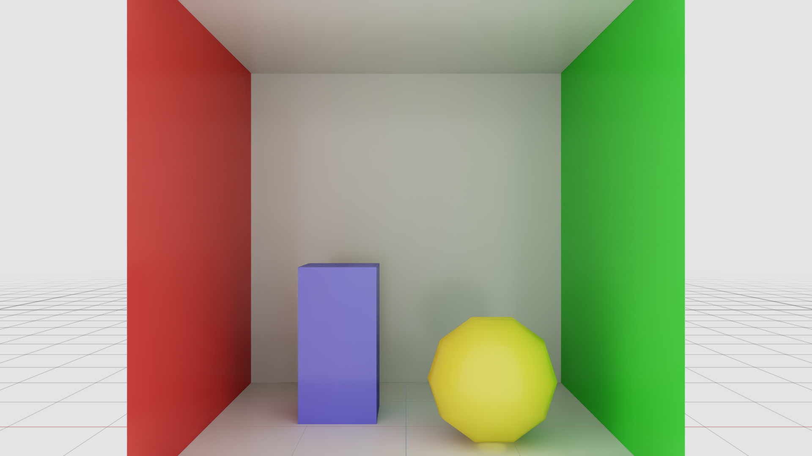

# SPG Built-in Nodes Example

Not every SPG node needs a custom CUDA kernel. SPG ships **built-in factory nodes** that you
author with `info:implementationSource = "id"` and an `info:id` — no `.cu` or `.cu.lua` required.
This example chains two stdlib nodes: **Add** doubles `LdrColor`'s brightness by adding it to
itself (saturating at 255), then **Scale** downscales that result to half resolution.

> **ovrtx 0.4 compatibility:** This example uses the deprecated renderer scene-loading API so it can remain focused on SPG authoring. Use the 0.3-to-0.4 migration skill when moving scene management to ovstage.

```usda
def Shader "AddNode"
{
    uniform token info:implementationSource = "id"
    uniform token info:id = "spg:rtx.spg.stdlib/Add"

    opaque inputs:A.connect = <../LdrColor.omni:rtx:aov>
    opaque inputs:B.connect = <../LdrColor.omni:rtx:aov>
    opaque outputs:Result
}

def Shader "ScaleNode"
{
    uniform token info:implementationSource = "id"
    uniform token info:id = "spg:rtx.spg.stdlib/Scale"

    float inputs:scaleX = 0.5
    float inputs:scaleY = 0.5
    opaque inputs:Input.connect = <../AddNode.outputs:Result>   # chain: consume Add's output
    opaque outputs:Output
}
```

The `spg:` prefix scopes the ID to SPG (so it never clashes with MaterialX or UsdPreview shader
IDs). The `ScaleNode` consumes `AddNode`'s output directly, so the brightened intermediate stays
internal to the chain and only the final `Downscaled` AOV is published.

> _“Chain two built-in SPG nodes (no custom CUDA) that brighten the color output and downscale it to half resolution, wired into a RenderProduct via info:id.”_



## Prerequisites

- Python 3.10-3.13
- [uv](https://docs.astral.sh/uv/)
- NVIDIA RTX-capable GPU
- Supported NVIDIA driver
- Unsandboxed runtime execution

## Running

```bash
uv run main.py
```

A successful run writes `_output/input.png` and `_output/downscaled.png`.

## Other built-in nodes

| Factory ID | Ports | Behavior |
|------------|-------|----------|
| `spg:rtx.spg.core/NoOp` | `Input` → `Output` | Passthrough; copies the first input texture to the first output. |
| `spg:rtx.spg.stdlib/Add` | `A`, `B` → `Result` | Per-channel saturating add (`min(A + B, 255)` for 8-bit). |
| `spg:rtx.spg.stdlib/Multiply` | `A`, `B` → `Result` | Per-channel normalized multiply (`floor(min(A * B / 255, 255))`). |
| `spg:rtx.spg.stdlib/Scale` | `Input`, `float scaleX`, `float scaleY` → `Output` | Nearest-neighbor resize. |
| `spg:rtx.spg.stdlib/Swizzle` | `Input`, `token swizzle` → `Output` | Channel permutation / constants. |

stdlib nodes operate on 2D textures only. See the **Sensor Processing Graphs** docs for details.
